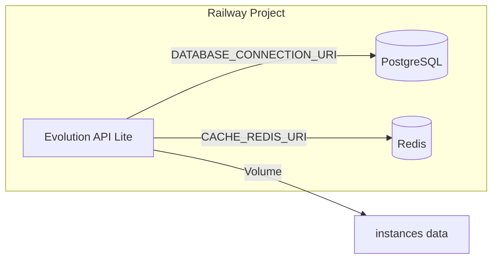

# Evolution API Lite Railway Template

[](https://railway.com/deploy/j-0IcK?referralCode=9uHSFr&utm_medium=integration&utm_source=template&utm_campaign=generic)

Railway deployment template for [Evolution API Lite](https://github.com/EvolutionAPI/evolution-api-lite), a lightweight WhatsApp API built on Baileys.

## Overview

This template enables one-click deployment of Evolution API Lite on Railway with PostgreSQL and Redis. Evolution API Lite is a streamlined version of Evolution API, focusing solely on connectivity without integrations (Typebot, Chatwoot, OpenAI, S3/Minio) and audio conversion features. **It does not include the manager dashboard** — administration must be done via REST API only. It is optimized for microservice environments where performance and simplicity are key.

**Target users:** Developers and small businesses needing lightweight WhatsApp automation.

**Tech stack:** Evolution API Lite, PostgreSQL, Redis, Docker.

## Architecture



- **Evolution API Lite:** Main service exposing REST endpoints (port 8080)
- **PostgreSQL:** Persistence for instances, messages, contacts, chats
- **Redis:** Cache and session management
- **Volume:** Persistent storage for WhatsApp instance auth data at `/evolution/instances`

## Deployment

### Prerequisites

- Railway account
- GitHub repository connected (this template)

### Steps

1. **New Project** → Deploy from GitHub repo
2. **Add PostgreSQL** → Railway dashboard → New → Database → PostgreSQL
3. **Add Redis** → Railway dashboard → New → Database → Redis
4. **Evolution API Lite service** → Connect this repo; Railway detects the Dockerfile
5. **Variables** → In the Evolution API Lite service Variables tab:
   - Click **Suggested Variables** to import from `.env.example` (Railway detects it automatically)
   - Or add manually:

   | Variable | Value |
   |----------|-------|
   | `DATABASE_PROVIDER` | `postgresql` |
   | `DATABASE_CONNECTION_URI` | `${{Postgres.DATABASE_URL}}` |
   | `CACHE_REDIS_URI` | `${{Redis.REDIS_URL}}` |
   | `CACHE_REDIS_ENABLED` | `true` |
   | `SERVER_URL` | `https://${{RAILWAY_PUBLIC_DOMAIN}}` |
   | `AUTHENTICATION_API_KEY` | `${{secret(64, "abcdef0123456789")}}` (auto-generates hex secret) or your own value |

6. **Volume** → Evolution API Lite service → Settings → Volumes → Add Volume → Mount path: `/evolution/instances`
7. **Generate Domain** → Evolution API Lite service → Settings → Generate Domain → Enable public domain

### Variable Detection and Auto-Generation

Railway automatically detects variables from `.env.example` when you connect a repository. In the service Variables tab, use **Suggested Variables** to import them.

For secrets and passwords, use **template variable functions** so Railway generates random values when someone deploys the template:

| Variable | Value (for template) | Effect |
|----------|----------------------|--------|
| `AUTHENTICATION_API_KEY` | `${{secret(64, "abcdef0123456789")}}` | Generates a 32-byte hex string (like `openssl rand -hex 32`) |

Other functions: `secret(length, alphabet)` for custom secrets, `randomInt(min, max)` for integers. See [Railway Template Docs](https://docs.railway.app/guides/create#template-variable-functions).

### Creating a Template

After deployment, convert the project to a template:

1. Project Settings → Generate template from project
2. In the template composer, for the Evolution API Lite service:
   - **Settings → Networking** → Enable **Public Networking** (HTTP) so the domain is auto-generated when users deploy
   - Evolution API Lite listens on port 8080; Railway proxies to it (public URL uses HTTPS on 443)
3. Set `AUTHENTICATION_API_KEY` to `${{secret(64, "abcdef0123456789")}}` so it auto-generates on deploy
4. Add descriptions for variables (shown to users)
5. Publish via the template flow

## Environment Variables

| Variable | Required | Description |
|----------|----------|-------------|
| `AUTHENTICATION_API_KEY` | Yes | API key for requests (header: `apikey`) |
| `DATABASE_PROVIDER` | Yes | Set to `postgresql` |
| `DATABASE_CONNECTION_URI` | Yes | PostgreSQL connection string |
| `CACHE_REDIS_URI` | Yes | Redis connection string |
| `CACHE_REDIS_ENABLED` | Yes | Set to `true` |
| `SERVER_URL` | Yes | Public URL of the API (e.g. `https://your-app.railway.app`) |

## Local Development

1. Copy `.env.example` to `.env`:

   ```bash
   cp .env.example .env
   ```

2. Edit `.env` and set `AUTHENTICATION_API_KEY` to a secure value.

3. Start services:

   ```bash
   docker compose up -d
   ```

4. Access the API at `http://localhost:8080`.

## API Usage

Evolution API Lite has no web dashboard. All operations are performed via REST API:

1. Create an instance: `POST /instance/create` with `apikey` header
2. Connect WhatsApp: `GET /instance/connect/{instanceName}` to get QR code
3. Send messages: `POST /message/sendText/{instanceName}`

Full documentation: [Evolution API Docs](https://doc.evolution-api.com).

## Maintenance

- **Logs:** Railway dashboard → Evolution API Lite service → Deployments → View logs
- **Updates:** Pull latest `atendai/evolution-api-lite:latest` and redeploy
- **Backup:** Export PostgreSQL data and volume contents if needed
